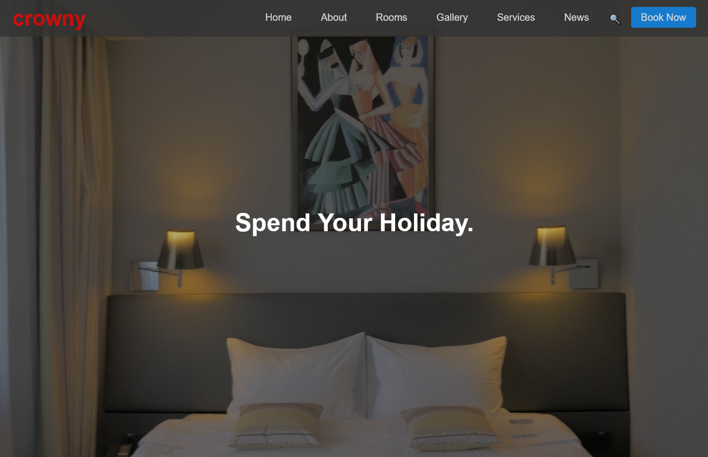
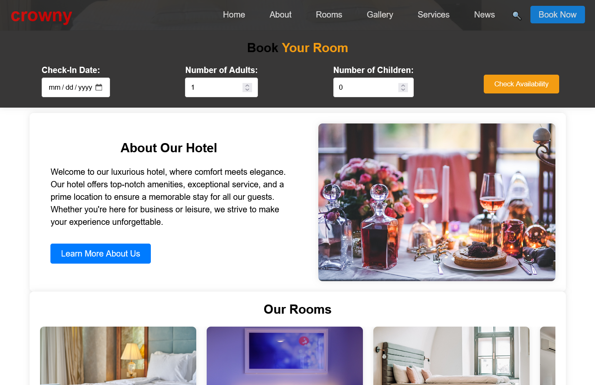

# 🏨 Crowny - Hotel Booking Website

**Crowny** is a fully responsive hotel website built to showcase a premium booking experience for guests. It highlights modern web design, smooth animations, and a clean UI built using HTML, CSS, and JavaScript.





---

## 🚀 Live Demo

👉 [View Website]([https://your-deployment-url.com](https://crowny-github-io.vercel.app/))

---

## 📌 Table of Contents

- [Features](#features)
- [Tech Stack](#tech-stack)
- [Getting Started](#getting-started)
- [Folder Structure](#folder-structure)
- [Screenshots](#screenshots)
- [License](#license)

---

## ✨ Features

- Responsive design for desktop, tablet, and mobile
- Hero section with call-to-action
- Room listings with details
- Booking form functionality
- Customer testimonials
- About Us & Contact section
- Smooth scrolling and interactive animations

---

## 🛠️ Tech Stack

- **HTML5** – Structure
- **CSS3 / Tailwind CSS** – Styling
- **JavaScript (Vanilla)** – Interactivity
- **GSAP / AOS / ScrollReveal** – Animations *(if used)*
- **Vite / Parcel / Live Server** – Development Environment *(optional)*

---

## 🧰 Getting Started

To run this project locally:

1. **Clone the repository:**

   ```bash
   git clone https://github.com/yourusername/crowny-hotel.git
   cd crowny-hotel
📄 License
This project is licensed under the MIT License – feel free to use and modify it.

🙌 Acknowledgements
Built with 💖 by Welidemedhin Mezene
For educational, portfolio, and freelance use.

⭐ Give a Star
If you like this project, please give it a star on GitHub!
It helps others discover the project and keeps me motivated 😊
